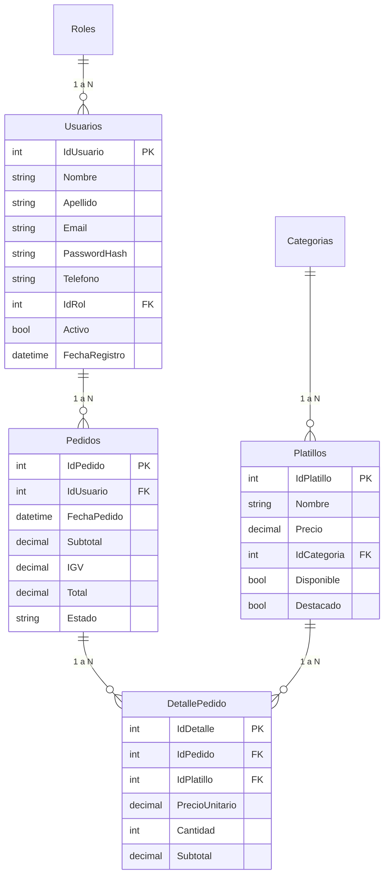

# 📖 MANUAL TÉCNICO Y GUÍA COMPLETA DE SUSTENTACIÓN — MAIDO

> **Proyecto:** Sistema Web de Gestión Gastronómica y Pedidos Online para Restaurante Nikkei  
> **Asignatura:** Desarrollo de Servicios Web I  
> **Tecnologías Principal:** ASP.NET Core 10.0 (C# 13), Microsoft SQL Server, ADO.NET / Stored Procedures, CSS3 Custom Design System (*Nikkei Noir*), QuestPDF, SweetAlert2.

---

## ⚡ RESUMEN EXPRESS DE 2 MINUTOS (ELEVATOR PITCH PARA EL PROFESOR)

Si el profesor te pide: *"Sustenta brevemente de qué trata tu proyecto y cómo está construido"*, responde lo siguiente:

> *"El proyecto **MAIDO** es un sistema web integral de e-commerce y gestión operativa para un restaurante de alta cocina Nikkei, construido sobre **ASP.NET Core 10.0 MVC** y **SQL Server**.  
>  
> Arquitectónicamente, el sistema sigue una **Arquitectura en 4 Capas (N-Tier)** completamente desacoplada: **Domain** (entidades e interfaces), **Application** (lógica de negocio y DTOs), **Infrastructure** (acceso a datos asíncrono con ADO.NET y Stored Procedures) y **PLGUI** (presentación en MVC con diseño CSS puro sin frameworks pesados).  
>  
> Entre sus innovaciones técnicas destacan la **creación atómica de pedidos en una sola transacción SQL mediante `OPENJSON`**, el control de stock y accesos en tiempo real mediante **Toggle Switches interactivos**, métricas ejecutivas **KPIs en tiempo real en el Dashboard**, filtrado asíncrono en vivo con **AJAX** y generación de **reportes ejecutivos en PDF con QuestPDF**."*

---

## 📑 TABLA DE CONTENIDOS

1. [Arquitectura de Software (4 Capas N-Tier)](#1-arquitectura-de-software-4-capas-n-tier)
2. [Punto de Entrada e Inyección de Dependencias (`Program.cs`)](#2-punto-de-entrada-e-inyección-de-dependencias-programcs)
3. [Base de Datos y Diagrama ER (`maido_db.sql`)](#3-base-de-datos-y-diagrama-er-maido_dbsql)
4. [La Operación Estrella: Transacción Atómica de Pedidos (`sp_RegistrarPedidoTransaccional`)](#4-la-operación-estrella-transacción-atómica-de-pedidos-sp_registrarpedidotransaccional)
5. [Recorrido de Datos de Extremo a Extremo (Flujo End-to-End)](#5-recorrido-de-datos-de-extremo-a-extremo-flujo-end-to-end)
6. [Módulos Principales y Reglas de Negocio](#6-módulos-principales-y-reglas-de-negocio)
7. [Decisiones de Diseño UI/UX (Estética *Nikkei Noir*)](#7-decisiones-de-diseño-uiux-estética-nikkei-noir)
8. [🔥 GUÍA DE ESTUDIO: BANCO DE PREGUNTAS Y RESPUESTAS DEL PROFESOR](#8--guía-de-estudio-banco-de-preguntas-y-respuestas-del-profesor)

---

## 1. ARQUITECTURA DE SOFTWARE (4 CAPAS N-TIER)

La solución fue estructurada siguiendo el patrón de **Arquitectura en Capas (N-Tier / Clean Architecture)** para garantizar mantenibilidad, aislamiento de fallas y alta escalabilidad:

```
Maido Solution/
├── 📁 Maido.Domain          (Capa 1: Dominio - Sin dependencias externas)
├── 📁 Maido.Application     (Capa 2: Aplicación / Casos de Uso y DTOs)
├── 📁 Maido.Infrastructure  (Capa 3: Acceso a Datos con ADO.NET y SQL Server)
└── 📁 Maido.PLGUI           (Capa 4: Presentación - Controllers, Views, PDF, Session)
```

### 🔹 Capa 1: `Maido.Domain`
* **¿Qué contiene?:** Entidades puras C# (`Platillo`, `Categoria`, `Usuario`, `Rol`, `Pedido`, `DetallePedido`) y los contratos/interfaces de persistencia (`IPlatilloRepository`, `IPedidoRepository`, etc.).
* **Regla de oro:** No tiene referencias a ningún proyecto ni paquete NuGet web o de base de datos.

### 🔹 Capa 2: `Maido.Application`
* **¿Qué contiene?:** Los DTOs (*Data Transfer Objects*), las interfaces de servicios (`IPlatilloService`, `IPedidoService`, etc.) y sus implementaciones concretas (`PlatilloService`, `PedidoService`, etc.).
* **Propósito:** Contener las reglas de negocio (cálculo de montos, mapeos de entidades a DTOs, validaciones).

### 🔹 Capa 3: `Maido.Infrastructure`
* **¿Qué contiene?:** El acceso físico a SQL Server. Utiliza `DbConnectionFactory` (inyectado como Singleton) y repositorios que ejecutan `SqlCommand` asíncronos (`ExecuteReaderAsync`, `ExecuteNonQueryAsync`) llamando a **Stored Procedures**.

### 🔹 Capa 4: `Maido.PLGUI`
* **¿Qué contiene?:** Controladores MVC (`AdminController`, `HomeController`, `CartController`, `CheckoutController`, `AccountController`), Vistas Razor (`.cshtml`), helpers de sesión (`CarritoHelper`, `SesionHelper`), motor de PDF (`ReporteVentasPdfBuilder`) y sistema de diseño en CSS3 puro.

---

## 2. PUNTO DE ENTRADA E INYECCIÓN DE DEPENDENCIAS (`Program.cs`)

En `Program.cs` se configuran los tres niveles de tiempo de vida (*Lifetimes*) de la Inyección de Dependencias de .NET:

```csharp
// 1. Singleton: Única instancia viva durante todo el ciclo de la aplicación
builder.Services.AddSingleton<DbConnectionFactory>();

// 2. Scoped: Una instancia nueva por cada solicitud HTTP recibida
builder.Services.AddScoped<IPlatilloRepository, PlatilloRepository>();
builder.Services.AddScoped<IPlatilloService, PlatilloService>();
builder.Services.AddScoped<IPedidoRepository, PedidoRepository>();
builder.Services.AddScoped<IPedidoService, PedidoService>();
// (Misma configuración para Categorías, Usuarios y Reportes)

// 3. Configuración de Sesión en Memoria (Timeout 60 minutos, Cookie Segura HTTP-Only)
builder.Services.AddDistributedMemoryCache();
builder.Services.AddSession(options =>
{
    options.IdleTimeout = TimeSpan.FromMinutes(60);
    options.Cookie.HttpOnly = true;
    options.Cookie.IsEssential = true;
    options.Cookie.Name = ".Maido.Session";
});
```

---

## 3. BASE DE DATOS Y DIAGRAMA ER (`maido_db.sql`)

El sistema utiliza 6 tablas relacionales estrictamente normalizadas:



---

## 4. LA OPERACIÓN ESTRELLA: TRANSACCIÓN ATÓMICA DE PEDIDOS (`sp_RegistrarPedidoTransaccional`)

Si el profesor pregunta: **"¿Cómo registran la venta y cómo evitan que la cabecera del pedido se guarde si falla un producto del detalle?"**, debes explicar este Stored Procedure:

```sql
CREATE OR ALTER PROCEDURE sp_RegistrarPedidoTransaccional
    @IdUsuario        INT,
    @TipoPedido       NVARCHAR(20),
    @DireccionEntrega NVARCHAR(300),
    @Telefono         NVARCHAR(20),
    @MetodoPago       NVARCHAR(50),
    @Subtotal         DECIMAL(10,2),
    @IGV              DECIMAL(10,2),
    @Total            DECIMAL(10,2),
    @Observaciones    NVARCHAR(500),
    @DetalleJSON      NVARCHAR(MAX), -- Recibe el carrito completo como arreglo JSON
    @IdPedido         INT OUTPUT
AS
BEGIN
    SET NOCOUNT ON;
    SET XACT_ABORT ON;

    BEGIN TRANSACTION;
    BEGIN TRY
        -- 1. Insertar la cabecera en Pedidos
        INSERT INTO Pedidos
            (IdUsuario, TipoPedido, DireccionEntrega, Telefono, MetodoPago, Subtotal, IGV, Total, Observaciones)
        VALUES
            (@IdUsuario, @TipoPedido, @DireccionEntrega, @Telefono, @MetodoPago, @Subtotal, @IGV, @Total, @Observaciones);

        SET @IdPedido = SCOPE_IDENTITY(); -- Captura el ID recién generado

        -- 2. Insertar todos los platillos del detalle procesando la cadena JSON con OPENJSON
        INSERT INTO DetallePedido
            (IdPedido, IdPlatillo, NombrePlatillo, PrecioUnitario, Cantidad, Subtotal)
        SELECT
            @IdPedido,
            CAST(j.IdPlatillo AS INT),
            j.NombrePlatillo,
            CAST(j.PrecioUnitario AS DECIMAL(10,2)),
            CAST(j.Cantidad AS INT),
            CAST(j.PrecioUnitario AS DECIMAL(10,2)) * CAST(j.Cantidad AS INT)
        FROM OPENJSON(@DetalleJSON)
        WITH (
            IdPlatillo     INT            '$.IdPlatillo',
            NombrePlatillo NVARCHAR(150)  '$.NombrePlatillo',
            PrecioUnitario DECIMAL(10,2)  '$.PrecioUnitario',
            Cantidad       INT            '$.Cantidad'
        ) AS j;

        COMMIT TRANSACTION; -- Guarda todo si no hubo errores
    END TRY
    BEGIN CATCH
        ROLLBACK TRANSACTION; -- Revierte todo si ocurrió algún fallo
        SET @IdPedido = -1;
        THROW;
    END CATCH
END
```

---

## 5. RECORRIDO DE DATOS DE EXTREMO A EXTREMO (FLUJO END-TO-END)

### Ejemplo: El cliente realiza la compra del carrito
1. **Cliente en Browser (`Checkout.cshtml`):** Completa sus datos de entrega y hace clic en *"Pagar ahora"*.
2. **Controller (`CheckoutController.cs`):** Recibe los datos, lee el carrito actual almacenado en la sesión mediante `CarritoHelper.ObtenerCarrito(session)` y calcula Subtotal e IGV (18%).
3. **Application (`PedidoService.cs`):** Serializa la lista del carrito a formato JSON con `JsonSerializer.Serialize()` y llama al repositorio.
4. **Infrastructure (`PedidoRepository.cs`):** Abre la conexión asíncrona mediante `DbConnectionFactory`, crea un `SqlCommand` para `sp_RegistrarPedidoTransaccional` pasando los parámetros `@DetalleJSON` y recuperando `@IdPedido` como parámetro de salida (`ParameterDirection.Output`).
5. **Database (SQL Server):** Inicia la transacción, inserta la cabecera, extrae el ID con `SCOPE_IDENTITY()`, desempaqueta los productos con `OPENJSON` e inserta las filas del detalle en un solo viaje de ida y vuelta (*round-trip*). Si todo sale bien, ejecuta `COMMIT TRANSACTION`.
6. **Respuesta al Cliente:** Se limpia la sesión del carrito (`CarritoHelper.LimpiarCarrito(session)`) y se redirige a la vista de confirmación con el número de pedido generado.

---

## 6. MÓDULOS PRINCIPALES Y REGLAS DE NEGOCIO

### 6.1. Fórmulas de Negocio (Cálculo de Impuestos)
* **Subtotal:** Suma de `(PrecioUnitario × Cantidad)` de cada ítem del carrito.
* **IGV (18%):** `Subtotal × 0.18`
* **Total:** `Subtotal + IGV`

### 6.2. Panel Administrativo (`/Admin`)
* **Dashboard & KPIs:** Calcula dinámicamente:
  - 💰 *Ingresos de Hoy* y *Total Histórico* (sumando ventas de pedidos no cancelados).
  - 📦 *Nuevos Pedidos de Hoy*.
  - ⏳ *Pedidos Activos* (con estado `PENDIENTE`, `EN PREPARACION` o `EN CAMINO`).
  - ⚠️ *Platillos Agotados* (destacados con borde rojo de alerta si la cantidad es mayor a 0).
* **Toggle Switches en Tablas:** Permite activar/desactivar el stock de Platillos, estado de Categorías o acceso de Usuarios con 1 clic mediante formularios auto-enviables (`onchange="this.form.submit()"`).
* **Protección de Administrador:** En `Usuarios.cshtml`, la cuenta del Administrador principal mantiene su switch deshabilitado (`disabled`) para prevenir bloqueos accidentales.
* **Filtros e Historial por Usuario:** Permite ver los pedidos de un cliente específico enviando `idUsuario` como parámetro a la vista de Pedidos (`/Admin/Pedidos?idUsuario={id}`).
* **Generación de PDFs Executivos:** Se utiliza la librería **QuestPDF** en `ReporteVentasPdfBuilder.cs` para compilar reportes descargables por rango de fechas.

---

## 7. DECISIONES DE DISEÑO UI/UX (ESTÉTICA *NIKKEI NOIR*)

* **Diseño CSS Puro:** Desarrollado sin frameworks pesados (sin Bootstrap JS ni Tailwind), utilizando variables CSS nativas (`:root`) en `maido.css`.
* **Glassmorphism:** Tarjetas translúcidas con fondo `rgba(30, 30, 36, 0.75)` y borde tenue `rgba(255, 255, 255, 0.08)`.
* **Solución de Binding en Checkboxes ASP.NET Core:**
  En HTML, los checkboxes desmarcados no envían datos. Para solucionarlo, cada switch incluye un `<input type="hidden" name="campo" value="false" />` posicionado **después** del checkbox. En CSS se aplica el selector de hermano general `input:checked ~ .toggle-slider` para que el interruptor cambie visualmente a verde sin importar la presencia del campo oculto.

---

## 8. 🔥 GUÍA DE ESTUDIO: BANCO DE PREGUNTAS Y RESPUESTAS DEL PROFESOR

### ❓ Pregunta 1: ¿Por qué usaron ADO.NET con Stored Procedures en lugar de Entity Framework Core?
> **Respuesta:**  
> *"Elegimos ADO.NET explícitamente para tener control total sobre el rendimiento y la seguridad. Los Stored Procedures previenen ataques de inyección SQL, reducen el tráfico en la red gracias a la compilación previa del plan de ejecución en SQL Server y nos permitieron procesar transacciones complejas utilizando `OPENJSON`, algo que en ORMs generaría múltiples llamadas individuales a la base de datos."*

---

### ❓ Pregunta 2: ¿Cómo evitan que la base de datos falle si intentas eliminar un platillo o categoría que ya tiene pedidos registrados?
> **Respuesta:**  
> *"Implementamos la estrategia de **Soft Delete (Borrado Lógico)**. En el Stored Procedure `sp_EliminarPlatillo`, verificamos si el platillo ya existe en la tabla `DetallePedido`. Si ya existen pedidos asociados, en lugar de ejecutar un `DELETE` físico (que lanzaría un error de clave foránea `FK`), actualizamos la columna `Disponible = 0`. De esta manera, el producto desaparece de la venta pero el historial de ventas del restaurante permanece intacto."*

---

### ❓ Pregunta 3: ¿Dónde se almacena el carrito de compras y qué pasa si el servidor se reinicia?
> **Respuesta:**  
> *"El carrito se almacena en la **Sesión del Servidor (`ISession`)**, serializado en formato JSON a través del helper `CarritoHelper.cs`. Configuramos la sesión en `Program.cs` usando `AddDistributedMemoryCache()` con un tiempo de expiración de 60 minutos y cookies de tipo `HttpOnly` para prevenir ataques de scripting XSS."*

---

### ❓ Pregunta 4: ¿Cómo aseguran la protección contra ataques informáticos como CSRF y SQL Injection?
> **Respuesta:**  
> 1. **Contra SQL Injection:** Todos los repositorios usan `SqlCommand` parametrizados con `CommandType.StoredProcedure` (ninguna consulta concatena cadenas SQL a mano).  
> 2. **Contra CSRF (Cross-Site Request Forgery):** Todos los formularios POST en las vistas incluyen la directiva `@Html.AntiForgeryToken()` y sus acciones correspondientes en los controladores están decoradas con el atributo `[ValidateAntiForgeryToken]`.

---

### ❓ Pregunta 5: ¿Qué diferencia hay entre usar `AddScoped`, `AddSingleton` y `AddTransient` en `Program.cs`?
> **Respuesta:**  
> - **Singleton:** Crea una única instancia para toda la aplicación (`DbConnectionFactory`).  
> - **Scoped:** Crea una instancia por cada petición HTTP (`Services` y `Repositories`), reutilizándola durante toda esa solicitud.  
> - **Transient:** Crea una instancia nueva cada vez que se solicita el servicio.

---

### ❓ Pregunta 6: ¿Por qué usaron DTOs en lugar de pasar directamente las entidades de dominio a las Vistas Razor?
> **Respuesta:**  
> *"Para desacoplar la base de datos de la interfaz de usuario. Las entidades de dominio (`Usuario`, `Pedido`) contienen campos sensibles como contraseñas en hash o estructuras crudas. Los DTOs como `PedidoResumenDto` o `UsuarioDto` nos permiten transportar únicamente los datos que la vista necesita y agregar propiedades calculadas como `NombreCompleto` sin contaminar la entidad de la base de datos."*

---

### ❓ Pregunta 7: ¿Qué pasa si desactivo una categoría en el Admin? ¿Se siguen viendo sus platillos en la tienda?
> **Respuesta:**  
> *"No. El Stored Procedure `sp_ListarPlatillosPublico` realiza un `INNER JOIN` entre `Platillos` y `Categorias` filtrando únicamente donde `c.Activo = 1` y `p.Disponible = 1`. Al desactivar una categoría mediante su Toggle Switch, todos sus platillos se ocultan inmediatamente del menú público."*

---

### ❓ Pregunta 8: ¿Cómo funciona la exportación de reportes a PDF?
> **Respuesta:**  
> *"Utilizamos la librería **QuestPDF**. En `AdminController.ReportePdf`, el controlador solicita las ventas y platillos más vendidos a `IReporteService` y se los envía a `ReporteVentasPdfBuilder.Generar()`, el cual compone el documento mediante un DSL fluente en C# y retorna un arreglo de bytes (`byte[]`) con el tipo MIME `application/pdf`."*

---

### ❓ Pregunta 9: ¿Cómo aseguran que el Administrador no se desactive a sí mismo?
> **Respuesta:**  
> *"Tanto en la vista `Usuarios.cshtml` como en el controlador, la cuenta con `IdRol == 1` está protegida. En la vista, el switch se renderiza con el atributo `disabled`, impidiendo cualquier envío involuntario de estado."*

---
*Manual elaborado como guía de preparación para la sustentación oficial del proyecto MAIDO.*
