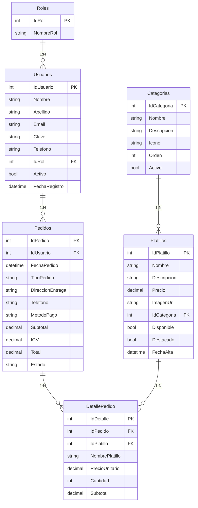

# 📖 MANUAL TÉCNICO Y GUÍA DE SUSTENTACIÓN — PROYECTO MAIDO

> **Proyecto:** Sistema Web de Gestión Gastronómica y Pedidos Online para Restaurante Nikkei  
> **Asignatura:** Desarrollo de Servicios Web I  
> **Tecnologías Principal:** ASP.NET Core 10.0 (C# 13), Microsoft SQL Server, ADO.NET / Stored Procedures, CSS3 Custom Design System (Sin frameworks externos), QuestPDF, SweetAlert2.

---

## 📑 TABLA DE CONTENIDOS

1. [Visión General del Proyecto](#1-visión-general-del-proyecto)
2. [Arquitectura de Software (N-Tier / Clean Architecture)](#2-arquitectura-de-software-n-tier--clean-architecture)
3. [Configuración del Sistema (`Program.cs`)](#3-configuración-del-sistema-programcs)
4. [Diseño y Lógica de la Base de Datos (`maido_db.sql`)](#4-diseño-y-lógica-de-la-base-de-datos-maido_dbsql)
5. [Operación Crítica: Transacción Atómica de Pedidos (`sp_RegistrarPedidoTransaccional`)](#5-operación-crítica-transacción-atómica-de-pedidos-sp_registrarpedidotransaccional)
6. [Módulos del Sistema y Reglas de Negocio](#6-módulos-del-sistema-y-reglas-de-negocio)
7. [Sistema de Diseño UI/UX (Estética *Nikkei Noir*)](#7-sistema-de-diseño-uiux-estética-nikkei-noir)
8. [Patrones de Diseño y Decisiones de Implementación](#8-patrones-de-diseño-y-decisiones-de-implementación)
9. [Banco de Preguntas y Respuestas para la Sustentación](#9-banco-de-preguntas-y-respuestas-para-la-sustentación)

---

## 1. VISIÓN GENERAL DEL PROYECTO

El proyecto **MAIDO** es un sistema web integral diseñado para la gestión de un restaurante de alta cocina Nikkei (fusión peruano-japonesa). El sistema abarca dos grandes áreas operativas:

1. **Catálogo Público y Comercio Electrónico:** Permite a los clientes explorar la carta interactiva con filtrado en tiempo real, armar su carrito de compras con cálculo automático de IGV (18%), realizar el checkout especificando método de envío (Delivery/Recojo) y medio de pago, y dar seguimiento al estado de sus pedidos.
2. **Panel Administrativo (`/Admin`):** Un centro de control en tiempo real para la gerencia y personal del restaurante que permite monitorear métricas clave (KPIs de ingresos, órdenes activas, platillos sin stock), cambiar estados de pedidos en vivo, administrar la carta mediante *toggle switches* de un solo clic, gestionar usuarios con búsqueda client-side y exportar reportes ejecutivos en PDF.

---

## 2. ARQUITECTURA DE SOFTWARE (N-TIER / CLEAN ARCHITECTURE)

La solución fue estructurada siguiendo el patrón de **Arquitectura en Capas (N-Tier)** con separación clara de responsabilidades en 4 proyectos de C#:

```
Maido Solution/
├── 📁 Maido.Domain          (Capa de Dominio - BE)
├── 📁 Maido.Application     (Capa de Aplicación / Lógica de Negocio - BC)
├── 📁 Maido.Infrastructure  (Capa de Infraestructura / Datos - DALC)
└── 📁 Maido.PLGUI           (Capa de Presentación - Web Core MVC)
```

### 2.1. Maido.Domain (`Maido.Domain.csproj`)
* **Propósito:** Contiene el núcleo de datos del sistema. Define las entidades fundamentales y los contratos (interfaces de repositorios) que deben cumplirse sin depender de librerías externas ni frameworks web.
* **Componentes principales:**
  * `Entities/`: `Platillo.cs`, `Categoria.cs`, `Usuario.cs`, `Rol.cs`, `Pedido.cs`, `DetallePedido.cs`, `ReporteEntities.cs`.
  * `Interfaces/`: `IPlatilloRepository.cs`, `ICategoriaRepository.cs`, `IUsuarioRepository.cs`, `IPedidoRepository.cs`, `IReporteRepository.cs`.

### 2.2. Maido.Application (`Maido.Application.csproj`)
* **Propósito:** Contiene los casos de uso y la lógica de negocio del sistema. Convierte la información del dominio a DTOs (*Data Transfer Objects*) para desacoplar las entidades de la interfaz de usuario.
* **Componentes principales:**
  * `DTOs/`: `PlatilloDto`, `CrearPlatilloDto`, `ActualizarPlatilloDto`, `CategoriaDto`, `UsuarioDto`, `PedidoResumenDto`, `PedidoDetalleDto`, `CheckoutDto`, etc.
  * `Services/`: Implementación de los servicios de aplicación (`PlatilloService`, `CategoriaService`, `UsuarioService`, `PedidoService`, `ReporteService`).
  * `ApplicationServiceExtensions.cs`: Registro de inyección de dependencias para los servicios de aplicación.

### 2.3. Maido.Infrastructure (`Maido.Infrastructure.csproj`)
* **Propósito:** Se encarga del acceso físico a los datos a través de Microsoft SQL Server utilizando **ADO.NET (SqlCommand, SqlDataReader)** y **Stored Procedures**.
* **Componentes principales:**
  * `Persistence/DbConnectionFactory.cs`: Factoría encargada de crear conexiones hacia SQL Server utilizando la cadena de conexión inyectada.
  * `Repositories/`: Implementación directa de las interfaces de dominio (`PlatilloRepository`, `CategoriaRepository`, `UsuarioRepository`, `PedidoRepository`, `ReporteRepository`).
  * `InfrastructureServiceExtensions.cs`: Registro de inyección de dependencias de la capa de infraestructura.

### 2.4. Maido.PLGUI (`Maido.PLGUI.csproj`)
* **Propósito:** Capa de interfaz de usuario desarrollada en **ASP.NET Core MVC**. Proporciona los controladores, vistas Razor (`.cshtml`), helpers de sesión, sistema de diseño en CSS puro y generación de reportes en PDF.
* **Componentes principales:**
  * `Controllers/`: `AdminController`, `HomeController`, `CartController`, `CheckoutController`, `AccountController`, `ClienteController`.
  * `Helpers/`: `CarritoHelper.cs` (gestión de carrito en sesión), `SesionHelper.cs` (gestión de perfil/rol en sesión).
  * `Reports/`: `ReporteVentasPdfBuilder.cs` (generación de PDFs ejecutivos con QuestPDF).
  * `Views/`: Vistas de usuario final y panel administrativo.

---

## 3. CONFIGURACIÓN DEL SISTEMA (`Program.cs`)

El archivo `Program.cs` actúa como el punto de entrada de la aplicación y configura los servicios e inyección de dependencias necesarias:

```csharp
using Maido.Application.BL.BC.Services;
using Maido.Infrastructure.DL.DALC.Configuration;

var builder = WebApplication.CreateBuilder(args);

// 1. Inclusión de MVC
builder.Services.AddControllersWithViews();

// 2. Configuración del estado de Sesión (Memoria Distribuida)
builder.Services.AddDistributedMemoryCache();
builder.Services.AddSession(options =>
{
    options.IdleTimeout = TimeSpan.FromMinutes(60);
    options.Cookie.HttpOnly = true;
    options.Cookie.IsEssential = true;
    options.Cookie.Name = ".Maido.Session";
});

// 3. Inyección modular por capas
builder.Services.AddInfrastructureServices();
builder.Services.AddApplicationServices();

// 4. Configuración de licencia Community para QuestPDF
QuestPDF.Settings.License = QuestPDF.Infrastructure.LicenseType.Community;

// 5. Inyección de IHttpContextAccessor para acceder a la sesión en helpers
builder.Services.AddHttpContextAccessor();

var app = builder.Build();

// 6. Pipeline HTTP
if (!app.Environment.IsDevelopment())
{
    app.UseExceptionHandler("/Home/Error");
    app.UseHsts();
}

app.UseHttpsRedirection();
app.UseStaticFiles();
app.UseRouting();

app.UseSession();
app.UseAuthorization();

// 7. Enrutamiento del sistema
app.MapControllerRoute(
    name: "admin",
    pattern: "Admin/{action=Dashboard}/{id?}",
    defaults: new { controller = "Admin" });

app.MapControllerRoute(
    name: "default",
    pattern: "{controller=Home}/{action=Index}/{id?}");

app.Run();
```

---

## 4. DISEÑO Y LÓGICA DE LA BASE DE DATOS (`maido_db.sql`)

La base de datos `maido_db` consta de 6 tablas relacionales normalizadas:



---

## 5. OPERACIÓN CRÍTICA: TRANSACCIÓN ATÓMICA DE PEDIDOS (`sp_RegistrarPedidoTransaccional`)

Uno de los puntos más importantes a nivel de arquitectura y base de datos es la creación de pedidos. Para garantizar que la cabecera del pedido (`Pedidos`) y sus líneas de detalle (`DetallePedido`) se guarden de forma **atómica (todo o nada)**, el sistema utiliza un **Stored Procedure transaccional con parseo JSON integrado (`OPENJSON`)**:

```sql
CREATE OR ALTER PROCEDURE sp_RegistrarPedidoTransaccional
    @IdUsuario        INT,
    @TipoPedido       NVARCHAR(20),
    @DireccionEntrega NVARCHAR(300),
    @Telefono         NVARCHAR(20),
    @MetodoPago       NVARCHAR(50),
    @Subtotal         DECIMAL(10,2),
    @IGV              DECIMAL(10,2),
    @Total            DECIMAL(10,2),
    @Observaciones    NVARCHAR(500),
    @DetalleJSON      NVARCHAR(MAX), -- Arreglo JSON enviado desde C#
    @IdPedido         INT OUTPUT
AS
BEGIN
    SET NOCOUNT ON;
    SET XACT_ABORT ON;

    BEGIN TRANSACTION;
    BEGIN TRY
        -- 1. Insertar Cabecera
        INSERT INTO Pedidos
            (IdUsuario, TipoPedido, DireccionEntrega, Telefono,
             MetodoPago, Subtotal, IGV, Total, Observaciones)
        VALUES
            (@IdUsuario, @TipoPedido, @DireccionEntrega, @Telefono,
             @MetodoPago, @Subtotal, @IGV, @Total, @Observaciones);

        SET @IdPedido = SCOPE_IDENTITY();

        -- 2. Insertar Detalle mediante OPENJSON
        INSERT INTO DetallePedido
            (IdPedido, IdPlatillo, NombrePlatillo, PrecioUnitario, Cantidad, Subtotal)
        SELECT
            @IdPedido,
            CAST(j.IdPlatillo AS INT),
            j.NombrePlatillo,
            CAST(j.PrecioUnitario AS DECIMAL(10,2)),
            CAST(j.Cantidad AS INT),
            CAST(j.PrecioUnitario AS DECIMAL(10,2)) * CAST(j.Cantidad AS INT)
        FROM OPENJSON(@DetalleJSON)
        WITH (
            IdPlatillo     INT            '$.IdPlatillo',
            NombrePlatillo NVARCHAR(150)  '$.NombrePlatillo',
            PrecioUnitario DECIMAL(10,2)  '$.PrecioUnitario',
            Cantidad       INT            '$.Cantidad'
        ) AS j;

        COMMIT TRANSACTION;
    END TRY
    BEGIN CATCH
        ROLLBACK TRANSACTION;
        SET @IdPedido = -1;
        THROW;
    END CATCH
END
```

### ¿Por qué esta solución es superior?
1. **Rendimiento e Integridad:** En lugar de realizar múltiples llamadas a la base de datos desde C# dentro de un bucle `for`, todo el carrito se serializa a JSON en C# (`JsonConvert.SerializeObject`) y se envía en un **único viaje de ida y vuelta (round-trip)** hacia la base de datos.
2. **Atomicidad estricta:** Si ocurre una falla al insertar cualquiera de los platillos del detalle, `ROLLBACK TRANSACTION` revierte la inserción de la cabecera y el detalle, evitando pedidos huérfanos o datos corruptos.

---

## 6. MÓDULOS DEL SISTEMA Y REGLAS DE NEGOCIO

### 6.1. Módulo Público y Carrito de Compras
* **Cálculo de Impuestos:** El sistema maneja un cálculo transparente de **Subtotal e IGV (18%)**.
  $$\text{Subtotal} = \sum (\text{PrecioUnitario} \times \text{Cantidad})$$
  $$\text{IGV} = \text{Subtotal} \times 0.18$$
  $$\text{Total} = \text{Subtotal} + \text{IGV}$$
* **Filtrado AJAX del Menú (`/Home/Menu`):** Al presionar sobre un botón de categoría o escribir en el buscador público, JavaScript invoca la vista parcial `/Home/FiltrarMenu`, actualizando el contenedor `#contenedor-grilla` sin recargar la página completa.
* **Validación de Disponibilidad:** Si un platillo tiene `Disponible = false`, el botón de agregar se deshabilita y se muestra el distintivo **Agotado**.

### 6.2. Panel Administrativo (`/Admin`)

#### A. Dashboard (`/Admin`)
Muestra métricas calculadas en tiempo real a través de `ViewBag.Stats`:
* 💰 **Ingresos del Día y Totales:** Facturación acumulada de pedidos concluidos o activos.
* 📦 **Nuevos Pedidos del Día:** Total de órdenes recibidas en la fecha actual.
* ⏳ **Pedidos Activos:** Órdenes en estado *Pendiente*, *En Preparación* o *En Camino*.
* ⚠️ **Platillos Agotados:** Conteo dinámico de platillos sin stock. Muestra un borde rojo de alerta si el número es mayor a 0.

#### B. Gestión de Platillos (`/Admin/Platillos`)
* Paginación dinámica y filtrado por categorías.
* **Toggle Switch de Stock:** Permite marcar un platillo como "En Stock" o "Agotado" con un clic instantáneo que invoca a `TogglePlatillo`.
* **Soft Delete para Seguridad:** Al intentar eliminar un platillo que ya ha sido vendido en pedidos anteriores, la base de datos previene el error de clave foránea aplicando automáticamente un borrado lógico (`Disponible = 0`).

#### C. Gestión de Categorías (`/Admin/Categorias`)
* **Toggle Switch de Activación:** Al desactivar una categoría (`Activo = 0`), los platillos asociados a esa categoría se ocultan automáticamente del catálogo público (`sp_ListarPlatillosPublico` evalúa `c.Activo = 1`).
* **Regla de Borrado:** Si la categoría contiene platillos, se desactiva lógicamente (`Activo = 0`); de lo contrario, se elimina físicamente.

#### D. Gestión de Usuarios (`/Admin/Usuarios`)
* **Filtros por Roles y Estado:** Chips interactivos para filtrar usuarios por *Todos*, *Clientes*, *Admins*, *Activos* e *Inactivos*.
* **Búsqueda Client-Side Instantánea:** Buscador JavaScript que filtra por nombre, email o teléfono en tiempo real.
* **Toggle Switch de Estado:** Permite habilitar o deshabilitar accesos. La cuenta principal del Administrador se encuentra **protegida** para evitar el auto-bloqueo.
* **Navegación al Historial de Pedidos (`🛒 Pedidos`):** Cada usuario cuenta con un enlace hacia `/Admin/Pedidos?idUsuario={id}`, permitiendo auditar todas las compras realizadas por dicho cliente.

#### E. Gestión de Pedidos (`/Admin/Pedidos`)
* Flujo de trabajo de estados: `Pendiente` ➔ `En Preparación` ➔ `En Camino` ➔ `Entregado` (o `Cancelado`).
* Banner dinámico al filtrar por cliente específico con botón para remover el filtro.

#### F. Generación de Reportes PDF (`/Admin/Reportes` y `/Admin/ReportePdf`)
* Generación dinámica de reportes ejecutivos utilizando **QuestPDF**, compilando resúmenes de ventas y ranking de platillos más vendidos por rango de fechas.

---

## 7. SISTEMA DE DISEÑO UI/UX (ESTÉTICA *NIKKEI NOIR*)

Todo el frontend fue construido utilizando **CSS Puro (Vanilla CSS)** con variables personalizadas (`:root`), sin depender de frameworks como Tailwind o Bootstrap.

* **Paleta de Colores Curada:**
  * Fondo Principal: Dark Obsidian `#121216`
  * Tarjetas Glassmorphism: `#1E1E24` con bordes traslúcidos `rgba(255,255,255,0.08)`
  * Colores de Acento: Dorado Maido `#E0A96D` y Rojo Neón `#D9381E`
* **Tipografía:** Uso de fuentes Google Fonts (*Outfit* e *Inter*).
* **Componentes Interactivos:** Modales animados con SweetAlert2 y notificaciones flotantes toast.

---

## 8. PATRONES DE DISEÑO Y DECISIONES DE IMPLEMENTACIÓN

1. **Patrón DTO (Data Transfer Object):** Evita exponer las entidades de base de datos directamente a las vistas. Permite formatear datos (ej. combinar `Nombre` + `Apellido` en `NombreCliente`).
2. **Patrón Repository & Factory:** Aisla las consultas SQL y el manejo de `SqlCommand` en clases de repositorio dedicadas, desacoplando la lógica de negocio.
3. **Solución Técnica al Binding de Checkboxes en ASP.NET Core:**
   * En HTML estándar, un checkbox desmarcado no envía ningún valor en el POST form.
   * Para resolver esto, los formularios incluyen un `<input type="hidden" name="campo" value="false" />` posicionado **después** del checkbox. En CSS se aplica el selector de hermanos `input:checked ~ .toggle-slider` para mantener la concordancia visual y asegurar que el `BooleanModelBinder` lea `"true"` cuando está marcado y `"false"` cuando no lo está.

---

## 9. BANCO DE PREGUNTAS Y RESPUESTAS PARA LA SUSTENTACIÓN

### P1: ¿Por qué eligieron una arquitectura en 4 capas (N-Tier)?
> **Respuesta:** Para cumplir con el principio de responsabilidad única y alta mantenibilidad. Si mañana se desea cambiar la interfaz gráfica MVC por una API REST o una aplicación móvil, la lógica de negocio (`Maido.Application`) y el acceso a datos (`Maido.Infrastructure`) se mantienen intactos sin sufrir alteraciones.

### P2: ¿Cómo aseguran que un pedido no quede incompleto si la conexión falla a mitad de la compra?
> **Respuesta:** Toda la creación del pedido se realiza dentro del Stored Procedure `sp_RegistrarPedidoTransaccional`. Utiliza un bloque `BEGIN TRANSACTION ... COMMIT TRANSACTION` y parsea el detalle mediante `OPENJSON`. Si algo falla al insertar un producto, el bloque `CATCH` ejecuta `ROLLBACK TRANSACTION`, garantizando la atomicidad completa.

### P3: ¿Por qué no se usó un ORM como Entity Framework Core?
> **Respuesta:** Se utilizó **ADO.NET directo con Stored Procedures** para maximizar el rendimiento, tener control total sobre las consultas SQL, reducir la sobrecarga en memoria y aprovechar las capacidades nativas de SQL Server como `OPENJSON` y transacciones explícitas.

### P4: ¿Cómo manejan la seguridad de roles y sesiones?
> **Respuesta:** El sistema maneja una sesión en servidor (`.Maido.Session`) autenticando credenciales a través de `SesionHelper`. Cada acción administrativa verifica el rol mediante la guardia `EsAdmin()` (comprobando `IdRol == 1`). Si un usuario no autorizado intenta ingresar a `/Admin`, es redirigido automáticamente a la pantalla de Login.

---
*Manual elaborado para la sustentación oficial del proyecto MAIDO.*
