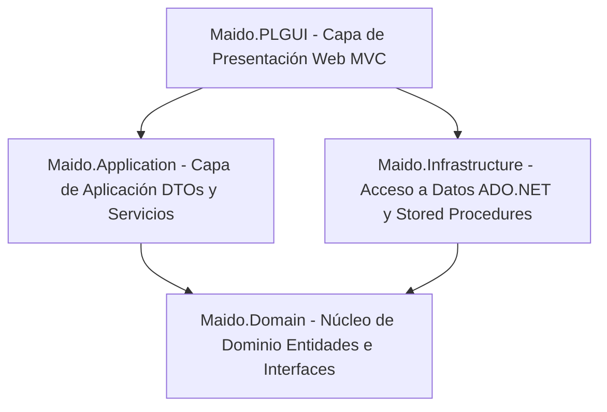
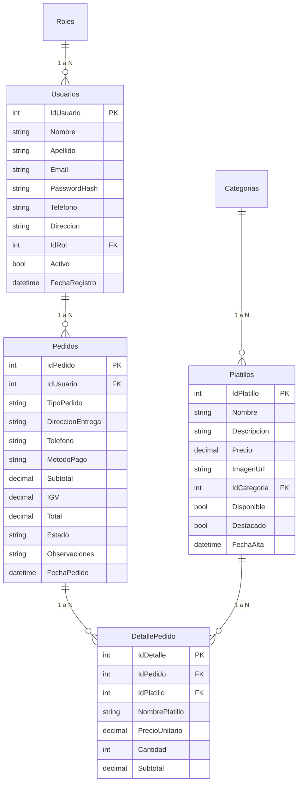
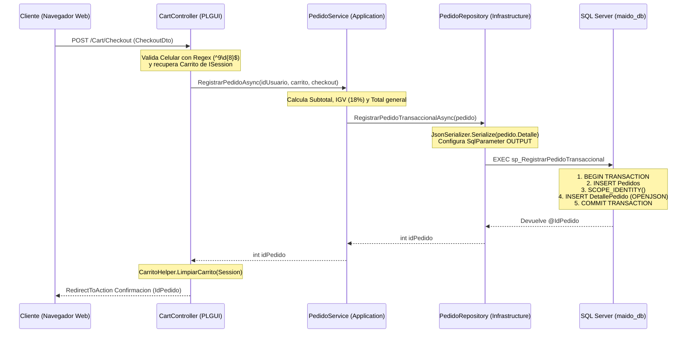

# 📖 MANUAL TÉCNICO Y GUÍA COMPLETA DE SUSTENTACIÓN — MAIDO

> **Proyecto:** Sistema Web de Gestión Gastronómica y Pedidos Online para Restaurante Nikkei  
> **Asignatura:** Desarrollo de Servicios Web I  
> **Tecnologías Principales:** ASP.NET Core 10.0 (C# 13), Microsoft SQL Server, ADO.NET / Stored Procedures, CSS3 Custom Design System (*Nikkei Noir*), QuestPDF, SweetAlert2.

---

## ⚡ RESUMEN EXPRESS DE 2 MINUTOS (ELEVATOR PITCH PARA EL PROFESOR)

Si el profesor te pide: *"Sustenta brevemente de qué trata tu proyecto y cómo está construido"*, responde lo siguiente:

> *"El proyecto **MAIDO** es un sistema web integral de e-commerce y gestión operativa para un restaurante de alta cocina Nikkei, construido sobre **ASP.NET Core 10.0 MVC** y **SQL Server**.  
>  
> Arquitectónicamente, el sistema sigue una **Arquitectura en 4 Capas (Clean Architecture / N-Tier)** totalmente desacoplada:  
> 1. **Domain**: Contiene las entidades puras del negocio e interfases de repositorio (Inversión de Dependencias - D de SOLID).  
> 2. **Application**: Aloja la lógica de negocio, validaciones, cálculo de impuestos (IGV 18%), hashing criptográfico SHA-256 y DTOs.  
> 3. **Infrastructure**: Implementa el acceso asíncrono a datos con ADO.NET y Stored Procedures en SQL Server.  
> 4. **PLGUI**: Presentación MVC con un sistema de diseño CSS3 puro, integración de sesiones HTTP, carrito de compras en memoria, filtrado dinámico AJAX con vistas parciales y reportes en PDF con QuestPDF.  
>  
> Entre sus principales fortalezas técnicas destacan la **creación atómica de pedidos en una sola transacción SQL utilizando `OPENJSON`**, el cifrado unidireccional de contraseñas con **SHA-256**, el control de seguridad anti-CSRF (`[ValidateAntiForgeryToken]`), la prevención de ataques IDOR y la arquitectura asíncrona de alto rendimiento (`async/await`)."*

---

## 📑 TABLA DE CONTENIDOS

1. [Arquitectura de Software (Clean Architecture / 4 Capas)](#1-arquitectura-de-software-clean-architecture--4-capas)
2. [Punto de Entrada e Inyección de Dependencias (`Program.cs`)](#2-punto-de-entrada-e-inyección-de-dependencias-programcs)
3. [Base de Datos y Diagrama ER (`maido_db.sql`)](#3-base-de-datos-y-diagrama-er-maido_dbsql)
4. [Seguridad Criptográfica: Hashing de Contraseñas (SHA-256)](#4-seguridad-criptográfica-hashing-de-contraseñas-sha-256)
5. [La Operación Estrella: Transacción Atómica de Pedidos con `OPENJSON`](#5-la-operación-estrella-transacción-atómica-de-pedidos-con-openjson)
6. [Mecanismos de Transferencia de Datos a las Vistas Razor](#6-mecanismos-de-transferencia-de-datos-a-las-vistas-razor)
7. [Procesamiento Asíncrono (`async` / `await` / `Task`)](#7-procesamiento-asíncrono-async--await--task)
8. [Subida de Archivos de Imagen (`IFormFile`)](#8-subida-de-archivos-de-imagen-iformfile)
9. [Interacción Asíncrona AJAX y Vistas Parciales (`PartialView`)](#9-interacción-asíncrona-ajax-y-vistas-parciales-partialview)
10. [Generación de Reportes PDF con QuestPDF](#10-generación-de-reportes-pdf-con-questpdf)
11. [Recorrido de Datos de Extremo a Extremo (Flujo End-to-End)](#11-recorrido-de-datos-de-extremo-a-extremo-flujo-end-to-end)
12. [Reglas de Negocio y Módulos Principales](#12-reglas-de-negocio-y-módulos-principales)
13. [🔥 GUÍA DE ESTUDIO: BANCO DE PREGUNTAS Y RESPUESTAS DEL PROFESOR](#13--guía-de-estudio-banco-de-preguntas-y-respuestas-del-profesor)

---

## 1. ARQUITECTURA DE SOFTWARE (CLEAN ARCHITECTURE / 4 CAPAS)

La solución está dividida en **4 proyectos separados** para garantizar la mantenibilidad, reutilización de código y el aislamiento de responsabilidades:

```
Maido Solution/
├── 📁 Maido.Domain          (Capa 1: Dominio - Entidades e Interfaces de Repositorio)
├── 📁 Maido.Application     (Capa 2: Aplicación - Servicios, Reglas de Negocio y DTOs)
├── 📁 Maido.Infrastructure  (Capa 3: Infraestructura - ADO.NET, DbConnectionFactory y SQL Server)
└── 📁 Maido.PLGUI           (Capa 4: Presentación - Controllers, Views, Helpers, Session, PDF)
```



### 🔹 Capa 1: `Maido.Domain` (Núcleo Puro del Dominio)
* **Contenido:**
  - **Entidades de Dominio:** [`Usuario.cs`](file:///C:/Users/antwn/Desktop/WS%20DSWI/Maido/Maido.Domain/BL.BE/Entities/Usuario.cs), [`Pedido.cs`](file:///C:/Users/antwn/Desktop/WS%20DSWI/Maido/Maido.Domain/BL.BE/Entities/Pedido.cs), [`DetallePedido.cs`](file:///C:/Users/antwn/Desktop/WS%20DSWI/Maido/Maido.Domain/BL.BE/Entities/DetallePedido.cs), [`Platillo.cs`](file:///C:/Users/antwn/Desktop/WS%20DSWI/Maido/Maido.Domain/BL.BE/Entities/Platillo.cs), [`Categoria.cs`](file:///C:/Users/antwn/Desktop/WS%20DSWI/Maido/Maido.Domain/BL.BE/Entities/Categoria.cs), [`ReporteEntities.cs`](file:///C:/Users/antwn/Desktop/WS%20DSWI/Maido/Maido.Domain/BL.BE/Entities/ReporteEntities.cs).
  - **Interfases de Repositorio:** [`IUsuarioRepository.cs`](file:///C:/Users/antwn/Desktop/WS%20DSWI/Maido/Maido.Domain/BL.BE/Interfaces/IUsuarioRepository.cs), [`IPedidoRepository.cs`](file:///C:/Users/antwn/Desktop/WS%20DSWI/Maido/Maido.Domain/BL.BE/Interfaces/IPedidoRepository.cs), [`IPlatilloRepository.cs`](file:///C:/Users/antwn/Desktop/WS%20DSWI/Maido/Maido.Domain/BL.BE/Interfaces/IPlatilloRepository.cs), [`ICategoriaRepository.cs`](file:///C:/Users/antwn/Desktop/WS%20DSWI/Maido/Maido.Domain/BL.BE/Interfaces/ICategoriaRepository.cs), [`IReporteRepository.cs`](file:///C:/Users/antwn/Desktop/WS%20DSWI/Maido/Maido.Domain/BL.BE/Interfaces/IReporteRepository.cs).
* **Concepto de Inversión de Dependencias (Principio D de SOLID):** El Dominio define *qué* operaciones de persistencia se necesitan (interfases), pero no sabe *cómo* se implementan. Esto independiza el núcleo del sistema de SQL Server o cualquier motor externo.

### 🔹 Capa 2: `Maido.Application` (Lógica de Negocio y Casos de Uso)
* **Contenido:**
  - **Servicios de Aplicación:** [`UsuarioService.cs`](file:///C:/Users/antwn/Desktop/WS%20DSWI/Maido/Maido.Application/BL.BC/Services/UsuarioService.cs), [`PedidoService.cs`](file:///C:/Users/antwn/Desktop/WS%20DSWI/Maido/Maido.Application/BL.BC/Services/PedidoService.cs), [`PlatilloService.cs`](file:///C:/Users/antwn/Desktop/WS%20DSWI/Maido/Maido.Application/BL.BC/Services/PlatilloService.cs), [`CategoriaService.cs`](file:///C:/Users/antwn/Desktop/WS%20DSWI/Maido/Maido.Application/BL.BC/Services/CategoriaService.cs), [`ReporteService.cs`](file:///C:/Users/antwn/Desktop/WS%20DSWI/Maido/Maido.Application/BL.BC/Services/ReporteService.cs).
  - **DTOs (Data Transfer Objects):** [`UsuarioDto.cs`](file:///C:/Users/antwn/Desktop/WS%20DSWI/Maido/Maido.Application/BL.BC/DTOs/UsuarioDto.cs), [`PedidoDto.cs`](file:///C:/Users/antwn/Desktop/WS%20DSWI/Maido/Maido.Application/BL.BC/DTOs/PedidoDto.cs), [`PlatilloDto.cs`](file:///C:/Users/antwn/Desktop/WS%20DSWI/Maido/Maido.Application/BL.BC/DTOs/PlatilloDto.cs), [`CategoriaDto.cs`](file:///C:/Users/antwn/Desktop/WS%20DSWI/Maido/Maido.Application/BL.BC/DTOs/CategoriaDto.cs), [`ReporteDto.cs`](file:///C:/Users/antwn/Desktop/WS%20DSWI/Maido/Maido.Application/BL.BC/DTOs/ReporteDto.cs).
* **Propósito:** Contiene las reglas del negocio: cálculo de impuestos (IGV 18%), encriptación SHA-256 de claves, mapeo manual entre Entidades y DTOs, y validación de duplicidad de emails.

### 🔹 Capa 3: `Maido.Infrastructure` (Acceso a Datos y Persistencia ADO.NET)
* **Contenido:**
  - **Fábrica de Conexiones:** [`DbConnectionFactory.cs`](file:///C:/Users/antwn/Desktop/WS%20DSWI/Maido/Maido.Infrastructure/DL.DALC/Persistence/DbConnectionFactory.cs) (lee la cadena de conexión `maido_db` de `appsettings.json`).
  - **Repositorios Concretos:** [`UsuarioRepository.cs`](file:///C:/Users/antwn/Desktop/WS%20DSWI/Maido/Maido.Infrastructure/DL.DALC/Repositories/UsuarioRepository.cs), [`PedidoRepository.cs`](file:///C:/Users/antwn/Desktop/WS%20DSWI/Maido/Maido.Infrastructure/DL.DALC/Repositories/PedidoRepository.cs), [`PlatilloRepository.cs`](file:///C:/Users/antwn/Desktop/WS%20DSWI/Maido/Maido.Infrastructure/DL.DALC/Repositories/PlatilloRepository.cs), [`CategoriaRepository.cs`](file:///C:/Users/antwn/Desktop/WS%20DSWI/Maido/Maido.Infrastructure/DL.DALC/Repositories/CategoriaRepository.cs), [`ReporteRepository.cs`](file:///C:/Users/antwn/Desktop/WS%20DSWI/Maido/Maido.Infrastructure/DL.DALC/Repositories/ReporteRepository.cs).
* **Implementación:** ADO.NET puro con `SqlConnection`, `SqlCommand`, `SqlDataReader` y `CommandType.StoredProcedure`.

### 🔹 Capa 4: `Maido.PLGUI` (Presentación Web ASP.NET Core MVC)
* **Contenido:**
  - **Controladores:** [`AccountController.cs`](file:///C:/Users/antwn/Desktop/WS%20DSWI/Maido/Maido.PLGUI/Controllers/AccountController.cs), [`AdminController.cs`](file:///C:/Users/antwn/Desktop/WS%20DSWI/Maido/Maido.PLGUI/Controllers/AdminController.cs), [`CartController.cs`](file:///C:/Users/antwn/Desktop/WS%20DSWI/Maido/Maido.PLGUI/Controllers/CartController.cs), [`ClienteController.cs`](file:///C:/Users/antwn/Desktop/WS%20DSWI/Maido/Maido.PLGUI/Controllers/ClienteController.cs), [`HomeController.cs`](file:///C:/Users/antwn/Desktop/WS%20DSWI/Maido/Maido.PLGUI/Controllers/HomeController.cs).
  - **Helpers:** [`SesionHelper.cs`](file:///C:/Users/antwn/Desktop/WS%20DSWI/Maido/Maido.PLGUI/Helpers/SesionHelper.cs), [`CarritoHelper.cs`](file:///C:/Users/antwn/Desktop/WS%20DSWI/Maido/Maido.PLGUI/Helpers/CarritoHelper.cs).
  - **Reportes y Vistas:** [`ReporteVentasPdfBuilder.cs`](file:///C:/Users/antwn/Desktop/WS%20DSWI/Maido/Maido.PLGUI/Reports/ReporteVentasPdfBuilder.cs), Vistas Razor `.cshtml` y archivos estáticos en `wwwroot`.

---

## 2. PUNTO DE ENTRADA E INYECCIÓN DE DEPENDENCIAS (`Program.cs`)

En [`Program.cs`](file:///C:/Users/antwn/Desktop/WS%20DSWI/Maido/Maido.PLGUI/Program.cs) se configuran los tiempos de vida (*Lifetimes*) de los servicios en el contenedor IoC:

```csharp
var builder = WebApplication.CreateBuilder(args);

// 1. Inyección de MVC y Cache de Memoria
builder.Services.AddControllersWithViews();
builder.Services.AddDistributedMemoryCache();

// 2. Configuración de Sesión Segura (Timeout 60 minutos, Cookie HttpOnly)
builder.Services.AddSession(options =>
{
    options.IdleTimeout = TimeSpan.FromMinutes(60);
    options.Cookie.HttpOnly = true;   // Previene lectura por Javascript (anti-XSS)
    options.Cookie.IsEssential = true;
    options.Cookie.Name = ".Maido.Session";
});

// 3. Registrar Capas de la Solución (Inyección de Dependencias)
builder.Services.AddInfrastructureServices(); // Singleton DbConnectionFactory + Scoped Repositories
builder.Services.AddApplicationServices();    // Scoped Services (UsuarioService, PedidoService, etc.)

// 4. Licencia Comunitaria de QuestPDF e HttpContextAccessor
QuestPDF.Settings.License = QuestPDF.Infrastructure.LicenseType.Community;
builder.Services.AddHttpContextAccessor();

var app = builder.Build();

// 5. Configuración del Pipeline de Middlewares
app.UseHttpsRedirection();
app.UseStaticFiles();
app.UseRouting();
app.UseSession();        // Debe ir ANTES de UseAuthorization
app.UseAuthorization();

// 6. Mapeo de Rutas (Admin Route & Default Route)
app.MapControllerRoute(
    name: "admin",
    pattern: "Admin/{action=Dashboard}/{id?}",
    defaults: new { controller = "Admin" });

app.MapControllerRoute(
    name: "default",
    pattern: "{controller=Home}/{action=Index}/{id?}");

app.Run();
```

---

## 3. BASE DE DATOS Y DIAGRAMA ER (`maido_db.sql`)

El sistema opera sobre una base de datos relacional en SQL Server (`maido_db`):



---

## 4. SEGURIDAD CRIPTOGRÁFICA: HASHING DE CONTRASEÑAS (SHA-256)

### Explicación Técnica para la Sustentación:
- **Ubicación**: Método `HashPassword` en [`UsuarioService.cs`](file:///C:/Users/antwn/Desktop/WS%20DSWI/Maido/Maido.Application/BL.BC/Services/UsuarioService.cs#L86-L91).
- **¿Por qué NUNCA se guardan contraseñas en texto plano?**  
  Por estándares de seguridad OWASP. Si la base de datos sufriera una filtración, las contraseñas reales jamás quedarían al descubierto.
- **¿Cómo funciona SHA-256?**
  ```csharp
  private static string HashPassword(string password)
  {
      using var sha256 = SHA256.Create();
      var bytes = sha256.ComputeHash(Encoding.UTF8.GetBytes(password));
      return BitConverter.ToString(bytes).Replace("-", "").ToLower();
  }
  ```
  1. `Encoding.UTF8.GetBytes(password)`: Convierte el texto de la clave en una secuencia de bytes binarios.
  2. `sha256.ComputeHash(...)`: Genera una huella digital única de 256 bits (32 bytes).
  3. `BitConverter.ToString(...)`: Convierte la matriz de bytes a una cadena hexadecimal fija de 64 caracteres.
- **Flujo de Autenticación**:
  ```csharp
  // En AutenticarAsync:
  if (u.PasswordHash != HashPassword(dto.Password)) 
      return null; // Credenciales inválidas
  ```

> [!IMPORTANT]
> **Defensa ante el Profesor**: SHA-256 es un algoritmo **unidireccional** (One-way Hash). No existe un método para "desencriptar" el hash devuelta a texto plano. Al autenticar, se toma la contraseña enviada por el formulario, se aplica el mismo algoritmo SHA-256 y se compara si ambos Hashes coinciden exactamente.

---

## 5. LA OPERACIÓN ESTRELLA: TRANSACCIÓN ATÓMICA DE PEDIDOS CON `OPENJSON`

### ¿Cómo se registra una venta completa en una sola transacción?
En aplicaciones tradicionales, guardar un pedido de 5 productos requería hacer 6 peticiones (*round-trips*) a SQL Server (1 para la cabecera y 5 para los detalles). En este proyecto se optimizó mediante **JSON y Transacciones Atómicas en SQL Server**:

1. **Serialización C#**: El servicio [`PedidoService.cs`](file:///C:/Users/antwn/Desktop/WS%20DSWI/Maido/Maido.Application/BL.BC/Services/PedidoService.cs) convierte la lista de productos del carrito a JSON con `JsonSerializer.Serialize(pedido.Detalle)`.
2. **Repositorio ADO.NET**: El repositorio [`PedidoRepository.cs`](file:///C:/Users/antwn/Desktop/WS%20DSWI/Maido/Maido.Infrastructure/DL.DALC/Repositories/PedidoRepository.cs) envía el string JSON como parámetro `@DetalleJSON` y configura un parámetro de salida `ParameterDirection.Output` para `@IdPedido`.
3. **Stored Procedure SQL Server** (`sp_RegistrarPedidoTransaccional` en [`maido_db.sql`](file:///C:/Users/antwn/Desktop/WS%20DSWI/Maido/maido_db.sql#L455-L500)):

```sql
CREATE OR ALTER PROCEDURE sp_RegistrarPedidoTransaccional
    @IdUsuario        INT,
    @TipoPedido       NVARCHAR(20),
    @DireccionEntrega NVARCHAR(300),
    @Telefono         NVARCHAR(20),
    @MetodoPago       NVARCHAR(50),
    @Subtotal         DECIMAL(10,2),
    @IGV              DECIMAL(10,2),
    @Total            DECIMAL(10,2),
    @Observaciones    NVARCHAR(500),
    @DetalleJSON      NVARCHAR(MAX), -- JSON con los productos
    @IdPedido         INT OUTPUT
AS
BEGIN
    SET NOCOUNT ON;
    SET XACT_ABORT ON; -- Si ocurre cualquier error, cancela automáticamente

    BEGIN TRANSACTION;
    BEGIN TRY
        -- 1. Insertar la cabecera del Pedido
        INSERT INTO Pedidos
            (IdUsuario, TipoPedido, DireccionEntrega, Telefono, MetodoPago, Subtotal, IGV, Total, Observaciones)
        VALUES
            (@IdUsuario, @TipoPedido, @DireccionEntrega, @Telefono, @MetodoPago, @Subtotal, @IGV, @Total, @Observaciones);

        SET @IdPedido = SCOPE_IDENTITY(); -- Obtiene el ID autonumérico asignado

        -- 2. Insertar todos los detalles deserializando el JSON con OPENJSON
        INSERT INTO DetallePedido
            (IdPedido, IdPlatillo, NombrePlatillo, PrecioUnitario, Cantidad, Subtotal)
        SELECT
            @IdPedido,
            CAST(j.IdPlatillo AS INT),
            j.NombrePlatillo,
            CAST(j.PrecioUnitario AS DECIMAL(10,2)),
            CAST(j.Cantidad AS INT),
            CAST(j.PrecioUnitario AS DECIMAL(10,2)) * CAST(j.Cantidad AS INT)
        FROM OPENJSON(@DetalleJSON)
        WITH (
            IdPlatillo     INT            '$.IdPlatillo',
            NombrePlatillo NVARCHAR(150)  '$.NombrePlatillo',
            PrecioUnitario DECIMAL(10,2)  '$.PrecioUnitario',
            Cantidad       INT            '$.Cantidad'
        ) AS j;

        COMMIT TRANSACTION; -- Confirmar cambios en disco
    END TRY
    BEGIN CATCH
        ROLLBACK TRANSACTION; -- Cancelar todo si falla un producto
        SET @IdPedido = -1;
        THROW;
    END CATCH
END
```

> [!TIP]
> **Propiedades ACID garantizadas**: 
> - **Atomicidad**: Se inserta todo (cabecera + N detalles) o no se inserta absolutamente nada.
> - **Consistencia**: La base de datos no sufre violaciones de claves foráneas.
> - **Aislamiento**: Ningún otro usuario ve el pedido a medio procesar.
> - **Durabilidad**: Una vez ejecutado el `COMMIT TRANSACTION`, la compra queda registrada permanentemente.

---

## 6. MECANISMOS DE TRANSFERENCIA DE DATOS A LAS VISTAS RAZOR

En ASP.NET Core MVC se utilizan 4 formas para transmitir información desde los Controladores hacia las Vistas Razor (`.cshtml`):

```mermaid
graph LR
    Controller[Controlador MVC] -->|Modelos Fuertemente Tipados| View1[View(dto)]
    Controller -->|ViewBag| View2[ViewBag.Categorias]
    Controller -->|ViewData| View3[ViewData['Title']]
    Controller -->|TempData| View4[TempData['Exito']]
```

1. **Modelos Fuertemente Tipados (`@model`)**:
   - Es el mecanismo principal y más seguro (proporciona Autocompletado IntelliSense y validación en tiempo de compilación).
   - Ejemplo: `return View(perfilDto);` en [`AccountController.Perfil`](file:///C:/Users/antwn/Desktop/WS%20DSWI/Maido/Maido.PLGUI/Controllers/AccountController.cs#L127).
2. **`ViewBag` (Objeto Dinámico)**:
   - Permite enviar colecciones secundarias o listas desplegables a la vista sin modificar el modelo principal.
   - Ejemplo: `ViewBag.Categorias = await _categoriaService.ListarPublicasAsync();` en [`AdminController.CrearPlatillo`](file:///C:/Users/antwn/Desktop/WS%20DSWI/Maido/Maido.PLGUI/Controllers/AdminController.cs#L101).
3. **`ViewData` (Diccionario de Objetos)**:
   - Estructura tipo Clave-Valor utilizada para metadatos compartidos del sistema (como el título en la pestaña del navegador).
   - Ejemplo: `ViewData["Title"] = "Iniciar Sesión - Maido";` en [`Login.cshtml`](file:///C:/Users/antwn/Desktop/WS%20DSWI/Maido/Maido.PLGUI/Views/Account/Login.cshtml#L20).
4. **`TempData` (Almacenamiento Temporal que Sobrevive a Redirecciones)**:
   - Almacena datos temporalmente en la sesión HTTP que sobreviven a un `RedirectToAction`. Ideal para mensajes Flash de éxito o error.
   - Ejemplo: `TempData["Exito"] = "Perfil actualizado correctamente.";` en [`AccountController.Perfil`](file:///C:/Users/antwn/Desktop/WS%20DSWI/Maido/Maido.PLGUI/Controllers/AccountController.cs#L148).

---

## 7. PROCESAMIENTO ASÍNCRONO (`async` / `await` / `Task`)

Toda la arquitectura del sistema ha sido construida con **Asincronía de extremo a extremo**:

- **¿Qué logra?**: Evita que los hilos del servidor web (Threads de Kestrel) queden bloqueados esperando respuestas I/O de la base de datos o el disco duro.
- **Firma de métodos**: Devuelven `Task` o `Task<T>`.
- **Métodos ADO.NET Asíncronos empleados en los Repositorios**:
  - `await connection.OpenAsync()`: Abre la conexión a SQL Server de forma no bloqueante.
  - `await command.ExecuteReaderAsync()`: Ejecuta la consulta de lectura asíncronamente.
  - `await reader.ReadAsync()`: Lee la siguiente fila del `SqlDataReader` sin congelar la CPU.
  - `await command.ExecuteScalarAsync()`: Obtiene un escalar (ej: ID generado) asíncronamente.
  - `await command.ExecuteNonQueryAsync()`: Ejecuta comandos de escritura asíncronamente.

---

## 8. SUBIDA DE ARCHIVOS DE IMAGEN (`IFormFile`)

En [`AdminController.cs`](file:///C:/Users/antwn/Desktop/WS%20DSWI/Maido/Maido.PLGUI/Controllers/AdminController.cs#L434-L454), la carga de imágenes de los platillos se realiza con el helper `GuardarImagenAsync`:

```csharp
private async Task<string?> GuardarImagenAsync(IFormFile? archivo)
{
    if (archivo is null || archivo.Length == 0) return null;

    // 1. Validar extensiones permitidas para prevenir subida de archivos maliciosos
    var extensiones = new[] { ".jpg", ".jpeg", ".png", ".webp" };
    var ext = Path.GetExtension(archivo.FileName).ToLowerInvariant();
    if (!extensiones.Contains(ext)) return null;

    // 2. Definir la ruta física del directorio wwwroot/uploads/platillos
    var uploadsPath = Path.Combine(_env.WebRootPath, "uploads", "platillos");
    Directory.CreateDirectory(uploadsPath);

    // 3. Generar un nombre de archivo único aleatorio con Guid para evitar colisiones
    var nombreArchivo = $"{Guid.NewGuid()}{ext}";
    var rutaCompleta = Path.Combine(uploadsPath, nombreArchivo);

    // 4. Copiar los bytes binarios del Stream de manera asíncrona no bloqueante
    using var stream = new FileStream(rutaCompleta, FileMode.Create);
    await archivo.CopyToAsync(stream);

    // 5. Retornar la URL relativa servible por IIS / Kestrel
    return $"/uploads/platillos/{nombreArchivo}";
}
```

---

## 9. INTERACCIÓN ASÍNCRONA AJAX Y VISTAS PARCIALES (`PartialView`)

Para ofrecer una experiencia de usuario rápida tipo SPA (Single Page Application):

1. **Filtrado de Carta por AJAX**: En [`HomeController.FiltrarMenu`](file:///C:/Users/antwn/Desktop/WS%20DSWI/Maido/Maido.PLGUI/Controllers/HomeController.cs#L43-L49), al escribir en la barra de búsqueda o cambiar de categoría, JavaScript invoca este endpoint y el servidor responde únicamente la **Vista Parcial** `PartialView("_PlatillosGrid", platillos)`.
2. **Operaciones de Carrito con AJAX y JSON**: En [`CartController.cs`](file:///C:/Users/antwn/Desktop/WS%20DSWI/Maido/Maido.PLGUI/Controllers/CartController.cs), métodos como `AgregarItem`, `ActualizarCantidad` y `EliminarItem` leen las solicitudes con `[FromBody]` usando records C# (`AgregarCarritoRequest`), manipulan el carrito guardado en la sesión HTTP con `CarritoHelper` y retornan JSON con `Json(new { success = true, ... })`.

---

## 10. GENERACIÓN DE REPORTES PDF CON QUESTPDF

En [`ReporteVentasPdfBuilder.cs`](file:///C:/Users/antwn/Desktop/WS%20DSWI/Maido/Maido.PLGUI/Reports/ReporteVentasPdfBuilder.cs), el sistema compone documentos ejecutivos PDF utilizando la librería **QuestPDF**:

- **Proceso**:
  1. El controlador [`AdminController.ReportePdf`](file:///C:/Users/antwn/Desktop/WS%20DSWI/Maido/Maido.PLGUI/Controllers/AdminController.cs#L419-L432) obtiene las ventas agregadas por fecha y el top de platillos desde `IReporteService`.
  2. Invoca a `ReporteVentasPdfBuilder.Generar(...)`, el cual construye vectorialmente las páginas, KPIs, tablas de datos y gráficos dinámicos.
  3. Convierte la maqueta en una matriz de bytes binaria `byte[]` llamando a `documento.GeneratePdf()`.
  4. El controlador transmite la descarga al navegador con el tipo MIME correspondiente:  
     `return File(pdfBytes, "application/pdf", nombreArchivo);`

---

## 11. RECORRIDO DE DATOS DE EXTREMO A EXTREMO (FLUJO END-TO-END)



---

## 12. REGLAS DE NEGOCIO Y MÓDULOS PRINCIPALES

1. **Cálculo Monetario Estándar**:
   - `Subtotal` = $\sum (\text{PrecioUnitario} \times \text{Cantidad})$
   - `IGV (18%)` = $\text{Math.Round}(\text{Subtotal} \times 0.18, 2)$
   - `Total` = $\text{Subtotal} + \text{IGV}$
2. **Validación con Expresiones Regulares (Regex)**:
   - Celular de cliente: Obligatorio en Perú, 9 dígitos numéricos empezando con 9 (`^9\d{8}$`).
3. **Control de Seguridad contra IDOR (Insecure Direct Object Reference)**:
   - En la edición de perfil ([`AccountController.Perfil`](file:///C:/Users/antwn/Desktop/WS%20DSWI/Maido/Maido.PLGUI/Controllers/AccountController.cs#L140)), se valida que el `IdUsuario` recibido en el DTO sea exactamente igual al `IdUsuario` almacenado en la sesión HTTP activa (`HttpContext.Session.GetInt32("Maido_IdUsuario")`), impidiendo que un usuario altere perfiles ajenos.
4. **Soft Delete (Borrado Lógico)**:
   - Para no romper la integridad referencial ni la contabilidad de pedidos históricos, al eliminar platillos o categorías se cambia su bandera de disponibilidad/activación (`Disponible = false`, `Activo = false`).

---

## 13. 🔥 GUÍA DE ESTUDIO: BANCO DE PREGUNTAS Y RESPUESTAS DEL PROFESOR

### ❓ Pregunta 1: "¿Por qué dividieron el proyecto en 4 capas y qué ventaja ofrece?"
> **Respuesta:**  
> *"Lo estructuramos en 4 capas siguiendo la **Clean Architecture**. La principal ventaja es el **desacoplamiento**: la capa de Dominio contiene las reglas del negocio puras e interfases sin depender de ninguna librería externa. Si el día de mañana deseamos cambiar la base de datos de SQL Server a PostgreSQL, o cambiar ADO.NET por Entity Framework Core, solo modificamos la capa de Infraestructura sin alterar la lógica de negocio ni la interfaz gráfica."*

---

### ❓ Pregunta 2: "¿Cómo funciona la seguridad de las contraseñas en su sistema?"
> **Respuesta:**  
> *"Utilizamos el algoritmo criptográfico estándar **SHA-256** implementado en la Capa de Aplicación en `UsuarioService.HashPassword`. Convertimos el string de la clave a bytes UTF-8, calculamos un hash de 256 bits y lo convertimos a una cadena hexadecimal de 64 caracteres. Al ser una función unidireccional (one-way), en el Login aplicamos el mismo proceso a la clave ingresada y comparamos si el hash resultante coincide exactamente con el `PasswordHash` almacenado en SQL Server."*

---

### ❓ Pregunta 3: "¿Cómo registraron las ventas y cómo garantizan que no queden pedidos a medias?"
> **Respuesta:**  
> *"Implementamos el Stored Procedure `sp_RegistrarPedidoTransaccional` usando **Transacciones SQL y `OPENJSON`**. C# serializa los productos del carrito a un arreglo JSON. En SQL Server abrimos un bloque `BEGIN TRANSACTION`, insertamos la cabecera, capturamos el ID con `SCOPE_IDENTITY()` y desglosamos e insertamos los detalles en una sola consulta con `OPENJSON`. Si ocurre alguna falla, el bloque `BEGIN CATCH` ejecuta `ROLLBACK TRANSACTION` revirtiendo toda la operación para garantizar las propiedades **ACID**."*

---

### ❓ Pregunta 4: "¿Qué diferencia hay entre `ViewBag`, `ViewData`, `TempData` y un Modelo Fuertemente Tipado?"
> **Respuesta:**  
> - ***Modelo Fuertemente Tipado (`@model`)**: Es el objeto C# principal que se pasa a `View(dto)`. Ofrece autocompletado y validación al compilar.  
> - ***ViewBag***: Objeto dinámico de C# para enviar colecciones auxiliares (como listas de categorías).  
> - ***ViewData***: Diccionario tipo clave-valor usado para datos globales como el título de la página.  
> - ***TempData***: Almacenamiento temporal respaldado por la sesión que sobrevive a una redirección (`RedirectToAction`), ideal para mostrar mensajes de éxito o error tras guardar un formulario.*

---

### ❓ Pregunta 5: "¿Cómo protegieron el sistema contra ataques SQL Injection y CSRF?"
> **Respuesta:**  
> - ***SQL Injection***: Todos los repositorios de Infraestructura utilizan `SqlCommand` parametrizados ejecutando Stored Procedures. Jamás se concatenan cadenas SQL en código C#.  
> - ***CSRF (Cross-Site Request Forgery)***: Todos los formularios enviantes por POST incluyen la directiva `@Html.AntiForgeryToken()` y los métodos de los controladores están decorados con el atributo `[ValidateAntiForgeryToken]`.*

---

### ❓ Pregunta 6: "¿Qué son `AddSingleton` y `AddScoped` y cómo los configuraron en `Program.cs`?"
> **Respuesta:**  
> - ***AddSingleton***: Registra un servicio del cual existirá **una sola instancia** durante todo el ciclo de vida de la aplicación. Lo usamos para `DbConnectionFactory`.  
> - ***AddScoped***: Registra servicios donde se crea **una nueva instancia por cada petición HTTP** recibida y se destruye al finalizar la respuesta. Lo usamos para todos los Repositorios y Servicios de Negocio.*

---

### ❓ Pregunta 7: "¿Cómo hicieron para que la búsqueda y filtrado de la carta no recarguen toda la página web?"
> **Respuesta:**  
> *"Utilizamos **AJAX con Vistas Parciales**. En `HomeController.FiltrarMenu`, el controlador procesa la consulta y retorna una vista parcial `PartialView("_PlatillosGrid", platillos)`. En el cliente, JavaScript captura la respuesta y reemplaza únicamente el contenedor del catálogo en el DOM sin recargar la barra de navegación ni el pie de página."*

---

### ❓ Pregunta 8: "¿Cómo funciona la persistencia del Carrito de compras?"
> **Respuesta:**  
> *"El carrito se almacena en la **Sesión HTTP (`ISession`)** del usuario mediante el helper `CarritoHelper`. Como `ISession` no acepta listas complejas directamente, serializamos el listado de `CarritoItem` a texto JSON con `JsonSerializer.Serialize`. Esto evita consultar la base de datos en cada clic del carrito, mejorando enormemente el rendimiento."*

---

*Manual elaborado como guía de preparación oficial para la sustentación del proyecto MAIDO (Desarrollo de Servicios Web I).*
